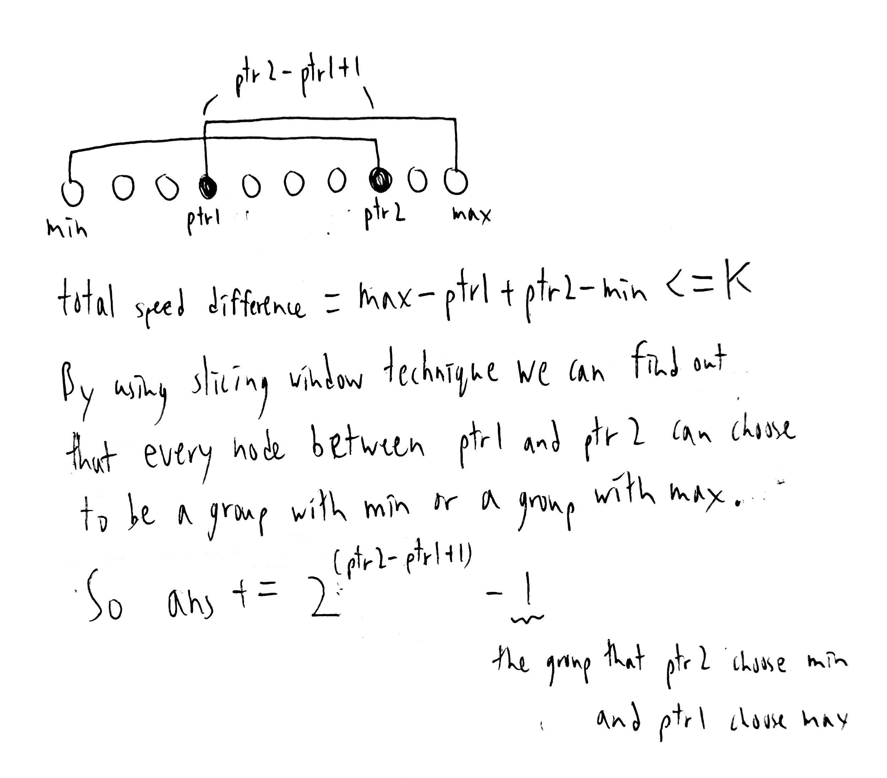

# Homework 1
#### B10902033 林祐辰
<br>
References:<br>
Problem 1: B10902032 李沛宸<br>
Problem 2: B10902032 李沛宸<br>
Problem 3: B10902032 李沛宸, Leetcode 1505<br>
Problem 4: B10902032 李沛宸<br>
Problem 5: B10902032 李沛宸<br>
Problem 6: B10902032 李沛宸<br>
<br>
Problem 5:<br>
(a) Optimal choice: picking the construction M0, M1, M4, M6, with the cost of 4, 5, 2, 3, and the total cost 14.
<br>
(b) Algorithm:<br>
First sort t array in an ascending order (bind with p). Next, insert W.p in a min_heap in order, and when W.t < T[++i] we add extractMin(min_heap) to min_cost.After i adding up to N, min_cost will be the answer.<br>
Time complexity:<br>
sort -> O(M log M), insert W.p in min_heap at most M times -> O(M log M), extract min from min_heap N times -> O(N logN).Total time complexity = O(M log M).<br>
Correctness:<br>
The substucture of this problem is N-1 with M-1 wich means that one weapon defend one wave. And by choosing greedily that is to choose the cheapist weapon before the deadline, we can maintain the optimal substructure. 
<br>
(c) Optimal choice: picking the construction M5, M1, M2, M7, M3, with the cost of 3, 1, 2, 5, 8, and the total cost 18.
<br>
(d)

<br>
(e) pass
<br>
(f)

<br>
Problem 6:<br>
(a) Algorithm:<br>

```C
min_total_speed_dif(V[N]){
    sort(V)  //ascending order
    min_dif = V[N-1] - V[0]  //max - min
    int V_dif[N-1]  //difference for every adjancent element
    for(i = 0 to N-2){
        V_dif[i] = V[i+1] - V[i]
    }
    sort(V_dif)  //descending order
    int ans[N]
    for(i = 0 to N-2){
        ans[i] = min_dif
        min_dif -= V_dif[i]
    }
    ans[N-1] = min_dif

    return ans
}
```
The time complexity is O(n log n), since we do two sort and two for loop, which is O(2 * (n log n) + 2 * n) = O(n log n).<br>
The algorithm works by choosing greedily, which is to cut the group at largest V_diff.<br>
Brief proof:<br>
<br>
(b) Algorithm:<br>

```C
ways_to_divide(V[N], K){
    sort(V)  //ascending order
    max_dif = V[N-1] - V[0]  //max - min
    int ans = 0
    for(i = 0 to N-2){
        if(max_dif - (V[i+1] - V[i]) <= k){
            ans++
        } 
    }
    int ptr1, ptr2 = 0  //pointer for sliding window
    while(ptr1 < N-1){
        if(ptr2 < N-1 and max_dif + V[ptr2+1] - V[ptr1] <= k){
            ptr2++
        }
        else{
            ans += 2^(ptr2-ptr1+1) - 1  //calculate ans by using sliding window
            ptr1++
        }
    }
    return ans
}
```
Time complexity:<br>
sort -> O(N log N), for loop -> O(N), while loop -> O(N).Total time complexity = O(N log N).<br>
Brief explain of sliding window technique:<br>
<br>
Correctness:<br>
The algorithm works by first calculate the ones that are divided in ordered groups, than calculate the ones that are divided in unordered groups and by simple calculate and sliding window technique we can be sure to seperate two groups with out missing or overlapping.
<br>
(c) 15 Groups:<br>
Group by 4: {{1, 2, 3, 4}}<br>
Group by 1: {{1}, {2}, {3}, {4}}<br>
Group by 2, 2: {{1, 2}, {3, 4}}, {{1, 3}, {2, 4}}, {{1, 4}, {2, 3}}<br>
Group by 1, 3: {{1}, {2, 3, 4}}, {{2}, {1, 3, 4}}, {{3}, {1, 2, 4}}, {{4}, {1, 2, 3}}<br>
Group by 1, 1, 2: {{1}, {2}, {3, 4}}, {{1}, {3}, {2, 4}}, {{1}, {4}, {2, 3}}, {{2}, {3}, {1, 4}}, {{2}, {4}, {1, 3}}, {{3}, {4}, {1, 2}}
<br>
(d)<br>
1.
<br>
(e) 9 Groups:<br>
Group by 1: {{1}, {2}, {3}, {5}}<br>
Group by 2, 2: {{1, 2}, {3, 5}}<br>
Group by 1, 3: {{1}, {2, 3, 5}}, {{5}, {1, 2, 3}}<br>
Group by 1, 1, 2: {{1}, {2}, {3, 5}}, {{1}, {3}, {2, 5}}, {{1}, {5}, {2, 3}}, {{2}, {5}, {1, 3}}, {{3}, {5}, {1, 2}}
<br>
(f)
