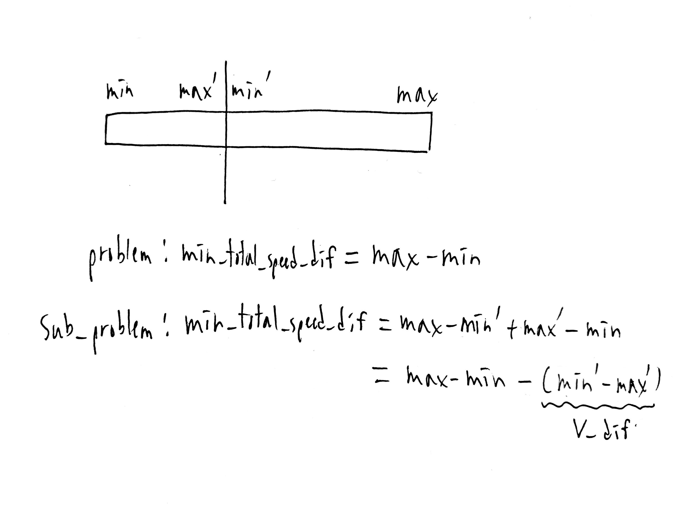

# Homework 1
#### B10902033 林祐辰
<br>
Problem 5:<br>
(a) Optimal choice: picking the construction M0, M1, M4, M6, with the cost of 4, 5, 2, 3, and the total cost 14.
<br>
(b) Algorithm:<br>
First sort t array in an ascending order (bind with p). Next, insert W.p in a min_heap in order, and when W.t < T[++i] we add extractMin(min_heap) to min_cost.After i adding up to N, min_cost will be the answer.<br>
Time complexity:<br>
sort -> O(M log M), insert W.p in min_heap at most M times -> O(M log M), extract min from min_heap N times -> O(N logN).Total time complexity = O(M log M).<br>
Correctness:<br>

<br>
(c) Optimal choice: picking the construction M5, M1, M2, M7, M3, with the cost of 3, 1, 2, 5, 8, and the total cost 18.
<br>
(d)

<br>
(e)

<br>
(f)

<br>
Problem 6:<br>
(a) Algorithm:<br>

```C
min_total_speed_dif(V[N]){
    sort(V)  //ascending order
    min_dif = V[N-1] - V[0]  //max - min
    int V_dif[N-1]  //difference for every adjancent element
    for(i = 0 to N-2){
        V_dif[i] = V[i+1] - V[i]
    }
    sort(V_dif)  //descending order
    int ans[N]
    for(i = 0 to N-2){
        ans[i] = min_dif
        min_dif -= V_dif[i]
    }
    ans[N-1] = min_dif

    return ans
}
```
The time complexity is O(n log n), since we do two sort and two for loop, which is O(2 * (n log n) + 2 * n) = O(n log n).<br>
The algorithm works by choosing greedily, which is to cut the group at largest V_diff.<br>
Brief proof:<br>
<br>
(b)
<br>
(c) 15 Groups:<br>
Group by 4: {{1, 2, 3, 4}}<br>
Group by 1: {{1}, {2}, {3}, {4}}<br>
Group by 2, 2: {{1, 2}, {3, 4}}, {{1, 3}, {2, 4}}, {{1, 4}, {2, 3}}<br>
Group by 1, 3: {{1}, {2, 3, 4}}, {{2}, {1, 3, 4}}, {{3}, {1, 2, 4}}, {{4}, {1, 2, 3}}<br>
Group by 1, 1, 2: {{1}, {2}, {3, 4}}, {{1}, {3}, {2, 4}}, {{1}, {4}, {2, 3}}, {{2}, {3}, {1, 4}}, {{2}, {4}, {1, 3}}, {{3}, {4}, {1, 2}}
<br>
(d)
<br>
(e) 9 Groups:<br>
Group by 1: {{1}, {2}, {3}, {5}}<br>
Group by 2, 2: {{1, 2}, {3, 5}}<br>
Group by 1, 3: {{1}, {2, 3, 5}}, {{5}, {1, 2, 3}}<br>
Group by 1, 1, 2: {{1}, {2}, {3, 5}}, {{1}, {3}, {2, 5}}, {{1}, {5}, {2, 3}}, {{2}, {5}, {1, 3}}, {{3}, {5}, {1, 2}}
<br>
(f)